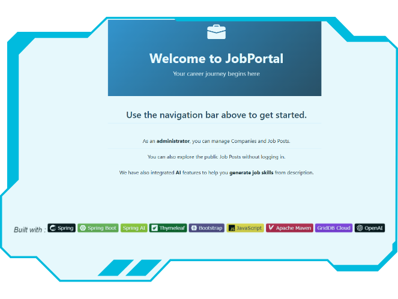
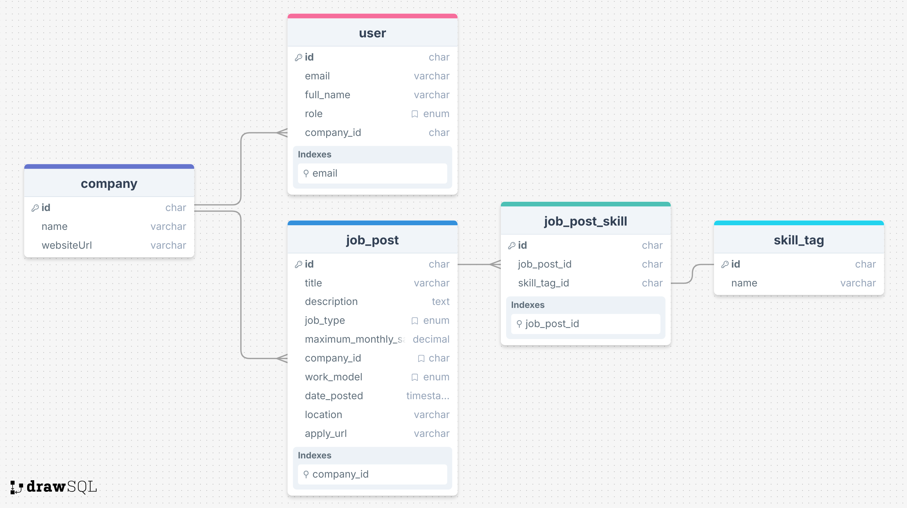
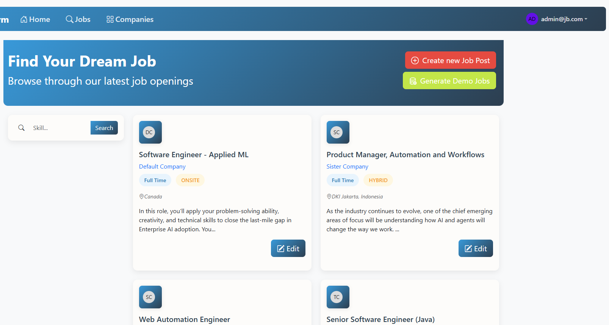
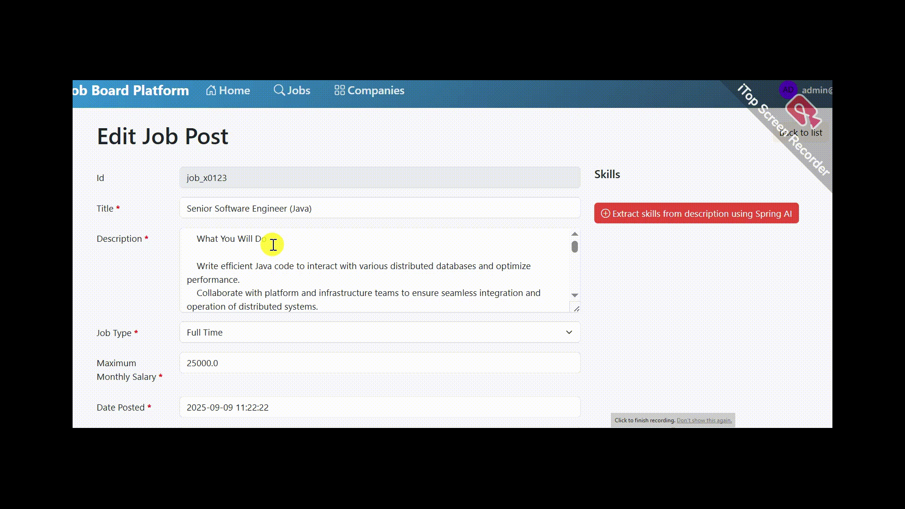

# Building a Modern Job Board with Spring Boot & GridDB Cloud



In this tutorial, we'll build a fully functional job board web application from the ground up. Our application will allow users to browse available positions, search for jobs based on specific skills, and administrators can manage job listings. We'll be working with three powerful technologies: **Spring Boot** to handle our backend component, *Thymeleaf* for creating dynamic web pages, and **GridDB Cloud** as our scalable database solution. As an exciting bonus, we'll also integrate **Spring AI** with OpenAI's language model to automatically generate relevant skill tags from job descriptions.

This project is designed to give you hands-on experience with real-world web development concepts. We'll start with the basics, setting up our development environment and cofiguring our database connection, then gradually build up to more advanced features like search functionality and AI integration.

By the time we're finished, you'll have a complete understanding of how modern web applications work, from data storage and business logic to user interfaces and AI-powered features.

## Prerequisites & Project Setup

First, let's make sure we have everything installed and configured properly before we start building our job board application.

**Development Tools:**
- [Java 17 or later](https://jdk.java.net/21/), [Maven 3.5+](https://maven.apache.org/download.cgi), and your favorite IDE ([IntelliJ IDEA](https://spring.io/guides/gs/intellij-idea/) or [VS Code](https://code.visualstudio.com/docs/languages/java))
- A GridDB Cloud account. You can sign up for a GridDB Cloud Free instance at https://form.ict-toshiba.jp/download_form_griddb_cloud_freeplan_e
- An OpenAI API account for the AI-powered skill generation feature. You can find your Secret API key on the API key page.

After completing the prerequisites, we'll create a new Spring Boot application using [Spring Initializr](https://start.spring.io/). Here's how we'll set it up:

1. Navigate to [start.spring.io](https://start.spring.io/)
2. Configure your project:
   - **Project**: Maven
   - **Language**: Java
   - **Spring Boot**: 3.5.x (latest stable version)
   - **Group**: com.example
   - **Artifact**: springboot-jobboard
   - **Java Version**: 17 or later

3. Add the following dependencies:
   - **Spring Web** - for creating our REST controllers and web layer
   - **Thymeleaf** - for server-side template rendering
   - **Spring Security** - for basic authentication (we'll keep it simple)

4. Click **Generate** to download a ZIP file with our project structure

Once you've downloaded and extracted the project, import it into your IDE. Then make sure we have the main project structure as follows:

```sh
├───java
│   └───com
│       └───example
│           └───springbootjobboard
│               ├───config
│               ├───controller
│               ├───domain
│               ├───model
│               ├───repos
│               ├───rest
│               ├───security
│               ├───service
│               ├───util
│               └───webapi
│                   └───acquisition

```

We'll then add the additional dependencies we need for GridDB Cloud integration and AI-powered features.

```xml
<dependency>
   <groupId>org.springframework.ai</groupId>
   <artifactId>spring-ai-starter-model-openai</artifactId>
   <version>1.0.1</version>
</dependency>
<dependency>
   <groupId>com.github.f4b6a3</groupId>
   <artifactId>tsid-creator</artifactId>
   <version>5.2.5</version>
</dependency>
<dependency>
   <groupId>org.apache.commons</groupId>
   <artifactId>commons-text</artifactId>
   <version>1.14.0</version>
</dependency>
```

> :bulb: **Tip**: If you prefer to skip the setup process, you can clone the completed project repository [here](https://github.com/alifruliarso?tab=repositories).

After adding all dependencies, next configure the application properties.

- GridDB Configuration

```txt
griddbcloud.base-url=YOUR_GRIDDBCLOUD_BASE_URL
griddbcloud.auth-token=YOUR_GRIDDBCLOUD_AUTH_TOKEN
```

- OpenAI API Key

```txt
spring.ai.openai.api-key=${OPENAI_API_KEY}
```

Then **Export** your Open AI API keys as environment variables:
   ```bash
   export OPENAI_API_KEY="your_api_key_here"
   ```

## Database Integration

To access the GridDB Web API endpoint, we must provide an access token in the HTTP Authorization header. The access token is a `Base64` encoded string of the username and password, separated by a colon. To access the configured values above, we need to bind the properties defined in the `application.properties` file to a POJO class using the `@ConfigurationProperties` annotation.

```java
// GridDbCloudClientProperties.java
@Component
@ConfigurationProperties(prefix = "griddbcloud")
public class GridDbCloudClientProperties {
    private String baseUrl;
    private String authToken;
    //setter, getter 
}
```

Next, we create `GridDbCloudClient` under `webapi` package, a centralized place to construct all HTTP requests to the GridDB Cloud Web API.

```java
// GridDbCloudClient.java
public class GridDbCloudClient {
    private final RestClient restClient;

    public GridDbCloudClient(String baseUrl, String authToken) {
        this.restClient =
            RestClient.builder()
                    .baseUrl(baseUrl)
                    .defaultHeader("Authorization", "Basic " + authToken)
                    .defaultHeader("Content-Type", "application/json")
                    .defaultHeader("Accept", "application/json")
                    .build();
    }

    public void createContainer(GridDbContainerDefinition containerDefinition) {
        restClient
            .post()
            .uri("/containers")
            .body(containerDefinition)
            .retrieve()
            .toBodilessEntity();
    }
}
```

- The `org.springframework.web.client.RestClient` is built and configured only once during application startup, and the same instance is reused.
- Use `baseUrl()` to set the common base URL for all requests made to the GridDB Cloud Web API.
- Configure the `Authorization` header that should be included in every request by default using `defaultHeader()`.
- The `Accept` HTTP request header tells the server that our client wants to receive a `JSON` content in the response.
- The `Content-Type` header tells the server that `JSON` data is being sent in the request body.

Next, add a helper method for adding rows to the specified container.

```java
// GridDbCloudClient.java
public void registerRows(String containerName, Object body) {
    ResponseEntity<String> result =
        restClient
            .put()
            .uri("/containers/" + containerName + "/rows")
            .body(body)
            .retrieve()
            .toEntity(String.class);
}
```
- The `registerRows` method: insert or update multiple rows of data in a specific GridDB container through the Web API. It takes the container's name and the rows to be registered as parameters.
- `.body(body)` we provide the Java object that will be automatically converted to JSON by Spring's message converter.

Next, we need to create a method to execute an SQL statement that combines rows from one or multiple tables. For example, search job postings by skill, need to join the table JobPost with Skill.

The GridDB Web API endpoint executes one or more SQL SELECT statements on a specific database:
- URL: `/:cluster/dbs/:database/sql/dml/query`
- HTTP Method: `Post`
- Example request body:
    ```json
    [
        {"stmt" : "select * from container1"},
        {"stmt" : "select * from myTable"}
    ]
    ```

Here is the helper method:

```java
public SQLSelectResponse[] select(List<GridDbCloudSQLStmt> sqlStmts) {
    try {
        ResponseEntity<SQLSelectResponse[]> responseEntity =
            restClient
                .post()
                .uri("/sql/dml/query")
                .body(sqlStmts)
                .retrieve()
                .toEntity(SQLSelectResponse[].class);
        return responseEntity.getBody();
    } catch (Exception e) {
        throw new GridDbException("Failed to execute /sql/dml/query",HttpStatusCode.valueOf(500),e.getMessage(),e);
    }
}
```

### Core Data Model

In a job board platform, the schema would include tables like Company, JobPost, JobPostSkill, SkillTag, and Users. The schema would facilitate efficient storage and retrieval of job postings, company information, job skills tags, and user roles.



- `User` has 3 roles: RECRUITER, ADMIN, and APPLICANT.
- Job post types are: FULL_TIME("Full Time"), PART_TIME("Part Time"), CONTRACT("Contract"), INTERNSHIP("Internship")
- Work models are: ONSITE, HYBRID, and REMOTE.
- Each job post can have multiple skills.

This database design should support the process of creating and searching jobs in general. We will build our application based on this design. Let's start with our primary data in a job board. 

#### Job Post

The `job_post` table is the most important data model, representing a single job listing.

We need to create a class to centralize the database operations from creating tables, querying rows, and creating or updating rows. Here is our container class:

<details open>
<summary>service/JobPostContainer.java</summary>

```java
@Component
public class JobPostContainer {
    private final Logger log = LoggerFactory.getLogger(getClass());
    private final GridDbCloudClient gridDbCloudClient;
    private static final String TBL_NAME = "JBJobPost";

    public JobPostContainer(GridDbCloudClient gridDbCloudClient) {
        this.gridDbCloudClient = gridDbCloudClient;
    }

    public void createTable() {
        List<GridDbColumn> columns =
                List.of(
                        new GridDbColumn("id", "STRING", Set.of("TREE")),
                        new GridDbColumn("title", "STRING"),
                        new GridDbColumn("description", "STRING"),
                        new GridDbColumn("jobType", "STRING", Set.of("TREE")),
                        new GridDbColumn("maximumMonthlySalary", "DOUBLE"),
                        new GridDbColumn("datePosted", "TIMESTAMP"),
                        new GridDbColumn("companyId", "STRING", Set.of("TREE")),
                        new GridDbColumn("workModel", "STRING", Set.of("TREE")),
                        new GridDbColumn("location", "STRING"),
                        new GridDbColumn("applyUrl", "STRING"));

        GridDbContainerDefinition containerDefinition =
                GridDbContainerDefinition.build(TBL_NAME, columns);
        this.gridDbCloudClient.createContainer(containerDefinition);
    }
}
```
- Here, the `GridDbCloudClient` is being injected into `JobPostContainer` via the constructor. By using constructor injection, we get some advantages: preventing circular dependencies at compile time and easier to unit test by simply passing mock or stub implementations of dependencies directly to the constructor during testing.

```java
public void saveRecords(List<JobPostRecord> jobPostRecords) {
    StringBuilder sb = new StringBuilder();
    sb.append("[");
    for (int i = 0; i < jobPostRecords.size(); i++) {
        JobPostRecord record = jobPostRecords.get(i);
        sb.append("[");
        sb.append("\"").append(record.id()).append("\"");
        sb.append(", ");
        sb.append("\"").append(StringEscapeUtils.escapeJson(record.title())).append("\"");
        sb.append(", ");
        sb.append("\"").append(StringEscapeUtils.escapeJson(record.description())).append("\"");
        sb.append(", ");
        sb.append("\"").append(record.jobType().name()).append("\"");
        sb.append(", ");
        sb.append(record.maximumMonthlySalary());
        sb.append(", ");
        sb.append("\"")
                .append(DateTimeUtil.formatToZoneDateTimeString(record.datePosted()))
                .append("\"");
        sb.append(", ");
        sb.append("\"").append(record.companyId()).append("\"");
        sb.append(", ");
        sb.append("\"").append(record.workModel().name()).append("\"");
        sb.append(", ");
        if (record.location() != null) {
            sb.append("\"")
                    .append(StringEscapeUtils.escapeJson(record.location()))
                    .append("\"");
        } else {
            sb.append("null");
        }
        sb.append(", ");
        if (record.applyUrl() != null) {
            sb.append("\"").append(record.applyUrl()).append("\"");
        } else {
            sb.append("null");
        }
        sb.append("]");
        if (i < jobPostRecords.size() - 1) {
            sb.append(", ");
        }
    }
    sb.append("]");
    String result = sb.toString();
    this.gridDbCloudClient.registerRows(TBL_NAME, result);
}
```

- `saveRecords(List<JobPostRecord> jobPostRecords)`: converts a list of `JobPostRecord` objects into a JSON-formatted string array and saves it to the GridDB instance using `GridDbCloudClient`. For `datePosted`, we should convert it into a string as UTC time format like `YYYY-MM-DDThh:mm:ss.SSSZ`. We escape the character in a String to prevent JSON parsing errors.

```java
    public List<JobPostRecord> getAll() {
        AcquireRowsRequest requestBody =
                AcquireRowsRequest.builder().limit(50L).sort("id ASC").build();
        AcquireRowsResponse response = this.gridDbCloudClient.acquireRows(TBL_NAME, requestBody);
        if (response == null || response.getRows() == null) {
            log.error("Failed to acquire rows from GridDB");
            return List.of();
        }
        List<JobPostRecord> jobPosts = convertResponseToRecord(response.getRows());
        return jobPosts;
    }

    public List<JobPostRecord> searchBySkill(String skill) {
        String stmt =
        """
            SELECT jp.* \
            FROM JBJobPost jp \
            JOIN JBCompany c ON jp.companyId = c.id \
            JOIN JBJobPostSkill jps ON jp.id = jps.jobPostId \
            JOIN JBSkillTag st ON jps.skillTagId = st.id \
            WHERE LOWER(st.name) IN ('%s') \
            GROUP BY jp.id, c.name
        """.formatted(skill.toLowerCase());

        List<GridDbCloudSQLStmt> statementList = List.of(new GridDbCloudSQLStmt(stmt));
        SQLSelectResponse[] response = this.gridDbCloudClient.select(statementList);
        if (response == null || response.length != statementList.size()) {
            // log.error("ERROR");
            return List.of();
        }

        List<List<Object>> results = response[0].getResults();
        if (results.isEmpty()) {
            log.info("No result for searching skill: {}", skill);
            return List.of();
        }

        List<JobPostRecord> records = convertResponseToRecord(results);
        return records;
    }
```

- `getAll()`: retrieves all job post records from a GridDB database, converts them into `JobPostRecord` objects, and returns them as a List.

- `searchBySkill(String skill)`: find job posts that require a specific skill. We create a SQL query using Java's text block. The SQL query selects all columns from the JobPost table, joins with the Company, JobPostSkill, and SkillTag tables, then filters by skill name. Then wraps the SQL statement in a `GridDbCloudSQLStmt` object and sends it to the GridDB Cloud using the `select` method of the client.

</details>

### Service Layer

Next, we'll add the service layer that sits between the Web Controller and the Data Access layer.

```java
@Service
public class JobPostGridDbService {

    private final JobPostContainer jobPostContainer;

    public JobPostGridDbService(JobPostContainer jobPostContainer) {
        this.jobPostContainer = jobPostContainer;
    }

    public static String nextId() {
        return TsidCreator.getTsid().format("job_%s");
    }

    public List<JobPostDTO> findAll(String searchSkill) {
        final List<JobPostRecord> jobPosts;
        if (searchSkill != null && !searchSkill.isBlank()) {
            jobPosts = jobPostContainer.searchBySkill(searchSkill);
        } else {
            jobPosts = jobPostContainer.getAll();
        }
        return jobPosts.stream()
                .map(jobPost -> mapToDTO(jobPost, new JobPostDTO()))
                .collect(Collectors.toList());
    }
    public String create(final JobPostDTO jobPostDTO) {
        String id = (jobPostDTO.getId() != null) ? jobPostDTO.getId() : nextId();
        JobPostRecord newJobPost =
                new JobPostRecord(
                        id,
                        jobPostDTO.getTitle(),
                        jobPostDTO.getDescription(),
                        jobPostDTO.getJobType(),
                        jobPostDTO.getMaximumMonthlySalary(),
                        jobPostDTO.getDatePosted(),
                        jobPostDTO.getCompanyId(),
                        jobPostDTO.getWorkModel(),
                        jobPostDTO.getLocation(),
                        jobPostDTO.getApplyUrl());
        jobPostContainer.saveRecords(List.of(newJobPost));
        return id;
    }
}
```

- This `service` class hides the database operation
- After getting the query result, transform it into a `DTO` class.

```java
@Service
public class JobPostSkillGridDbService {

    private final JobPostSkillContainer jobPostSkillContainer;

    public JobPostSkillGridDbService(JobPostSkillContainer jobPostSkillContainer) {
        this.jobPostSkillContainer = jobPostSkillContainer;
    }

    public void replaceSkillsForJobPost(String jobPostId, List<String> skillTagIds) {
        deleteByJobPostId(jobPostId);
        if (!skillTagIds.isEmpty()) {
            createSkillsForJobPost(jobPostId, skillTagIds);
        }
    }
}
```

- `replaceSkillsForJobPost`: update the list of skills for a job. It first removes all skill associations for the current job, then creates new associations between the job post and each skill tag ID in the list.

## Web Controller

Next, let's add the web controller class. This layer is the entry point of our web application. It receives requests, coordinates with the service layer to fulfill the data requested, and ensures users get the responses they expect. We will try to keep the controller thin and focus on its core responsibilities.

<details open>
<summary>controller/JobPostController.java</summary>

```java
@Controller
@RequestMapping("/jobs")
public class JobPostController {
    private final Logger log = LoggerFactory.getLogger(getClass());

    private final JobPostGridDbService jobPostService;
    private final CompanyGridDbService companyService;
    private final JobPostSkillGridDbService jobPostSkillService;
    private final SkillTagGridDbService skillTagService;
    private final ChatModel chatModel;
    private final TableSeeder tableSeeder;

    private final Map<String, String> jobTypeValues =
            Arrays.stream(JobPostType.values())
                    .collect(
                            java.util.stream.Collectors.toMap(
                                    JobPostType::name, JobPostType::getLabel));

    public JobPostController(
            final JobPostGridDbService jobPostService,
            final CompanyGridDbService companyService,
            final JobPostSkillGridDbService jobPostSkillService,
            final SkillTagGridDbService skillTagService,
            ChatModel chatModel,
            TableSeeder tableSeeder) {
        this.jobPostService = jobPostService;
        this.companyService = companyService;
        this.jobPostSkillService = jobPostSkillService;
        this.skillTagService = skillTagService;
        this.chatModel = chatModel;
        this.tableSeeder = tableSeeder;
    }

    @ModelAttribute
    public void prepareContext(final Model model) {
        Map<String, String> companies =
                companyService.findAll().stream()
                        .collect(
                                java.util.stream.Collectors.toMap(
                                        com -> com.getId(), com -> com.getName()));
        model.addAttribute("jobTypeValues", jobTypeValues);
        model.addAttribute("workModelValues", WorkModel.values());
        model.addAttribute("companyIdValues", companies);
    }

    @GetMapping
    public String list(
            @RequestParam(name = "searchSkill", required = false) String searchSkill,
            final Model model) {
        List<JobPostDTO> jobs = jobPostService.findAll(searchSkill);
        List<JobListingResponse> jobPosts =
                jobs.stream()
                        .map(
                                jobPost -> {
                                    JobListingResponse response =
                                            buildJobPostResponse(jobPost.getId());
                                    return response;
                                })
                        .toList();
        model.addAttribute("jobPosts", jobPosts);
        model.addAttribute("searchSkill", searchSkill);
        return "jobs/list";
    }
}
```

- All dependencies (service, component) are injected using constructor injection.
- Annotated with `@ModelAttribute` the `prepareContext(final Model model)` will be executed before every controller method. It populates common attributes (job types, work models, companies), making it available to all Thymeleaf templates, useful for building dropdowns.

</details>

## Frontend using Thymeleaf

Thymeleaf provides a flexible approach to render dynamic web pages in Spring Boot applications. We use fragments to create reusable template components and structure the templates in logical directories.

```bash
src/
└── main/
    └── resources/
        ├── templates/
        │   ├── layout.html
        │   └── authentication/
        │   └── company/
        │   └── home/
        │   └── jobs/
        │   └── fragments/
        │       └── forms.html
        └── static/
            └── css/
```

### Job listing page

```html
<!DOCTYPE HTML>
<html xmlns:th="http://www.thymeleaf.org" xmlns:layout="http://www.ultraq.net.nz/thymeleaf/layout"
    xmlns:sec="http://www.thymeleaf.org/extras/spring-security" layout:decorate="~{layout}">

<head>
    <title>[[#{jobPost.list.headline}]]</title>
    <style type="text/css">
    </style>
</head>

<body>
    <div layout:fragment="content">
        <!-- Page Header -->
        <div class="page-header row mb-4">
            <div class="col-md-8">
                <h1 class="fw-bold">Find Your Dream Job</h1>
                <p class="fs-3">Browse through our latest job openings
                </p>
            </div>
            <div sec:authorize="hasRole('ADMIN')" class="col-md-4 text-md-end action-buttons mt-3 mt-md-0">
                <a sec:authorize="hasRole('ADMIN')" th:href="@{/jobs/add}"
                    class="btn btn-create btn-lg text-white me-2"><i class="bi bi-plus-circle me-1"></i>
                    [[#{jobPost.list.createNew}]]</a>
            </div>
        </div>

        <div class="row">
            <!-- Filters Sidebar -->
            <div class="col-lg-3">
                <form th:action="@{/jobs}" method="get">
                    <div class="filter-card card p-3 mb-4">
                        <div class="input-group">
                            <span class="input-group-text bg-transparent border-0">
                                <i class="bi bi-search"></i>
                            </span>
                            <input type="text" name="searchSkill" th:value="${searchSkill}"
                                class="form-control border-0 bg-transparent" placeholder="Skill...">
                            <button class="btn btn-primary">Search</button>
                        </div>
                    </div>
                </form>
            </div>

            <!-- Job Listings -->
            <div class="col-lg-9">
                <div class="row row-cols-1 row-cols-md-2 g-4">
                    <div th:each="jobPost : ${jobPosts}" class="col">
                        <div class="card job-card h-100">
                            <div class="card-body">
                                <div class="d-flex justify-content-between align-items-start mb-3">
                                    <div class="company-logo"></div>
                                </div>
                                <h5 class="card-title">
                                    <a th:text="${jobPost.title}" th:href="@{/jobs/view/{id}(id=${jobPost.id})}"
                                        class="job-title-link">Developer</a>
                                </h5>
                                <p class="card-text mb-2">
                                    <a href="#" class="text-decoration-none"><span
                                            th:text="${jobPost.company.name}">jobType</span></a>
                                </p>
                                <div class="mb-3">
                                    <span th:text="${jobPost.jobType}" class="job-tag job-type">jobType</span>
                                    <!-- <span class="job-tag salary">$7,000 - $9,000</span> -->
                                    <span th:text="${jobPost.workModel}" class="job-tag work-mode">Hybrid</span>
                                </div>
                                <p class="card-text text-muted small">
                                    <i th:text="${jobPost.location}" class="bi bi-geo-alt me-1">
                                    </i>
                                </p>
                                <p th:text="${#strings.abbreviate(jobPost.description, 150)}" class="card-text"></p>
                                <div class="d-flex justify-content-between align-items-center action-buttons">
                                    <span class="text-muted small"></span>
                                    <a sec:authorize="!hasRole('ADMIN')" th:href="@{/jobs/view/{id}(id=${jobPost.id})}"
                                        class="btn btn-lg btn-primary">View Details</a>
                                    <a sec:authorize="hasRole('ADMIN')" th:href="@{/jobs/edit/{id}(id=${jobPost.id})}"
                                        class="btn btn-lg btn-primary"><i class="bi bi-pencil-square"></i> Edit</a>
                                </div>
                            </div>
                        </div>
                    </div>
                </div>
            </div>
        </div>
        <script src="https://cdnjs.cloudflare.com/ajax/libs/jquery/3.7.1/jquery.min.js"></script>
    </div>
</body>

</html>
```

- The `Create New Job` button is only available for ADMIN.
- We provide a search form to let users filter jobs by skill.
- We use `th:each` attribute to iterate over a list of jobs. Each job post is shown as a card. The job description was abbreviated to 150 characters. Edit button only for ADMIN. The title is a clickable link to the job details.
- For the styling we uses Bootstrap 5 and custom CSS.

Here is what it looks like as an admin:



## Spring AI Integration

Next, we introduce an intelligent feature that automates the process of adding relevant skills to a job post.

We will leverage *Spring AI*, a powerful library that simplifies communication between our Spring Boot application and advanced AI models from providers like OpenAI. The process is straightforward: when an admin is creating or editing a job post, they can click a "Generate Skills" button. Behind the scenes, our application prepares relevant data before sending it to the OpenAI model and consumes the output.

The most important part, we want to turn the AI-generated response into structured data like a Java record.

```java
private List<SkillTagDTO> generateSkills(JobPostDTO jobPostDTO, List<SkillTagDTO> skillTags)
            throws JsonProcessingException, JsonMappingException {
    ObjectMapper objectMapper = new ObjectMapper();
    String skillCatalogJson = objectMapper.writeValueAsString(skillTags);
    BeanOutputConverter<SkillResponse> outputConverter =
                new BeanOutputConverter<>(new ParameterizedTypeReference<SkillResponse>() {});
    String format = outputConverter.getFormat();
    // @formatter:off
    String promptStr =
            """
            You are an AI assistant that extracts required skills from a job description.
            TASK:
            - Only return skills present in the provided JSON skill catalog.
            - Matching is case-insensitive.
            - Do not invent or include skills not in the catalog.
            - Output strictly as a JSON array of objects.

            NOW PROCESS:
            <JOB_DESCRIPTION>
            {jobDescription}
            </JOB_DESCRIPTION>
            <SKILL_LIST>
            {skillCatalog}
            </SKILL_LIST>

            {format}
        """;
    // @formatter:on
    Prompt prompt =
            PromptTemplate.builder()
                    .template(promptStr)
                    .build()
                    .create(
                            Map.of(
                                    "jobDescription",jobPostDTO.getDescription(),
                                    "skillCatalog",skillCatalogJson,
                                    "format",format),
                            OpenAiChatOptions.builder()
                                    .responseFormat(new ResponseFormat(ResponseFormat.Type.JSON_OBJECT, null))
                                    .build());
    var generation = this.chatModel.call(prompt).getResult();
    String outputText = generation.getOutput().getText();
    SkillResponse skillResponse = outputConverter.convert(outputText);
    return skillResponse.skills();
}

record SkillResponse(List<SkillTagDTO> skills) {}
```

- We use the low-level `ChatModel` API directly.
- Use Jackson's `ObjectMapper` to convert the list of `SkillTagDTO` objects into JSON string. We want the AI Model to give us skills that only present in our provided skill catalog.
- `BeanOutputConverter`: to generate a JSON schema based on a given Java class, which is then used to transform the LLM output into our desired type `SkillResponse` record.
- We build the prompt using a template and inject the job description, skill catalog (as JSON), and the output format. We configure the OpenAI Chat API to respond with a JSON object through `OpenAiChatOptions`.
- Send the prompt to the OpenAI chat model using its `call` method.
- Gets the AI's output text, use `outputConverter` to parse the JSON response into `SkillResponse` object. Return the list of extracted skills.

*Demo showing generate skills from job description using Spring AI and OpenAI.*



## Running the Project: End-to-End Execution

```bash
export OPENAI_API_KEY=your_key
```

Build the project and run the application in development mode.

```bash
mvn clean package

mvn spring-boot:run
```

Open <a href="http://localhost:8080" target="_blank">localhost.</a>

## Conclusion

In this tutorial, we've successfully built a fully functional job board web application that demonstrate the power of modern Java development. We've gained hands-on experience integrating *Spring Boot, Thymeleaf, and GridDB Cloud* to create a complete full-stack solution from the ground up.

One of the most exciting aspects of our implementation was integrating *Spring AI's* support for *OpenAI's* Structured Outputs. This feature transforms how web handle AI-generated content by ensuring predictable, well-formatted responses.

While this application provides a solid foundation for any job board platform, there are numerous features we can consider adding:
- A complete user authentication and registration.
- Allowing recruiters to register and post jobs under their own account.
- Introduce pagination to display jobs.
- Tracing the request and response of the LLM call into the observability platform.
- Add cache in generating skills. If the job description hasn't changed, then we should not call the OpenAI API.
